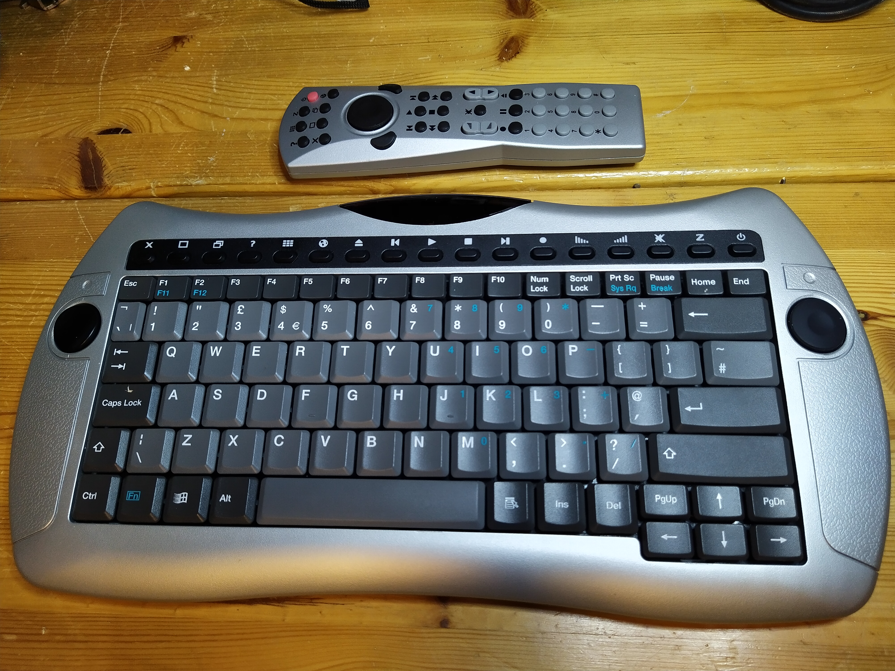

# IR-Keyboard
Arduino receiver for Infrared Keyboard FDC-3412

I got a mysterious infrared keyboard and remote labeled as FDC-3412.
I cannot find any info about it.

# Keyboard Protocol
By inspecting the keyboard protocol using an IR receiver I deciphered the following:
 * 1 start pulse 1000 us
 * 1 pause 500 us
 * 12 * pulse 500us followed by one of the following
    * space 450us == 00
    * space 650us == 01
    *  space 900us == 10
    *  space 1150us == 11

- 12 * 2 bits = 24 bits / message.
- Bytes are in low endian order.
- There are two versions of the message:
1. key message:
  * 8 bit header
  * 8 bit modifier
  * 8 bit code
  * 4 bit checksum
2. joy message:
  * 8 bit header
  * 6 bit x
  * 6 bit y
  * 4 bit zero padding
  * 4 bit checksum
 
## header
* 00000010 key event 
* 10000010 release key
* 01000010 repeat key
* 00100000 button1
* 01000000 button2
 
## modifier
* 0000 0001 shift
* 0000 0010 alt
* 0000 0100 ctrl
* 0000 1000 win

## x
signed 6 bit value
0 = center

## y
signed 6 bit value
0 = center

## checksum
Number of 1 bits in event + 2

## code
* 0x50 A
* 0x35 B
* ...

# Remote Joystick Protocol
The remote buttons are send with common RC-5 encoding, but the upper joystick and buttons have their own.
 * Manchester encoding whith base timing of 600us
 * 1 start pulse 1200 us
 * 16 bits / message
 * Bits are in low endian order.
   * 1 bit button 2
   * 7 bit x position as signed integer, center is 0
   * 1 bit button 1
   * 7 bit y position as signed integer, center is 0
